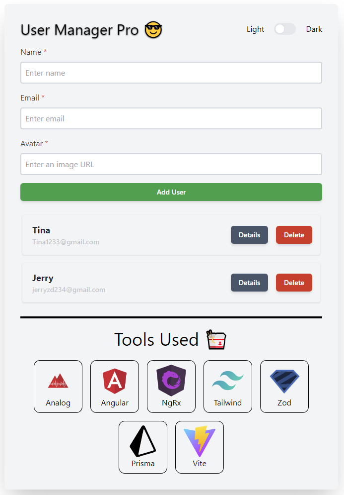
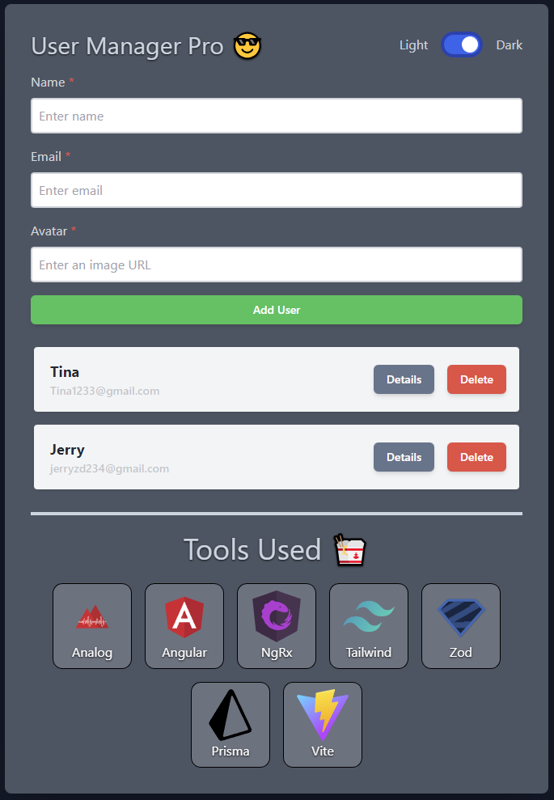
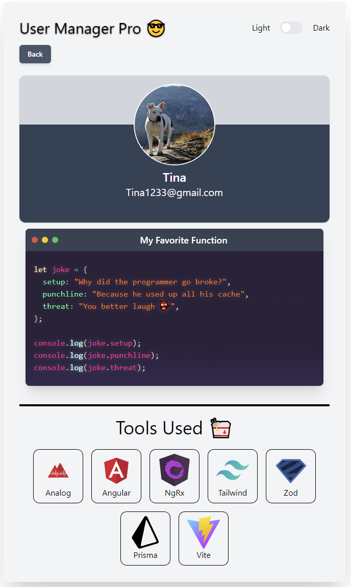
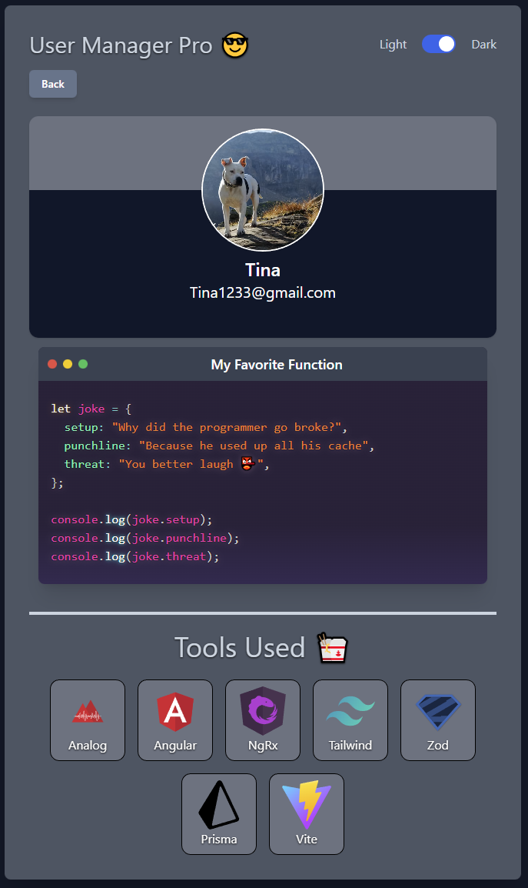

# User Manager 😎

This project uses [Analog JS](https://analogjs.org/) the full stack meta framework for Angular supporting Hybrid SSR/SSG with File-based routing and API routes along with NGRX for state management, Tailwind CSS for frontend styling, Zod for backend validation, and Prisma for the database ORM.

Honestly just a fun little side project to display NGRX and Analog JS. Not complex by any means but enojoyable to play around with 👨‍🎨

## Development

For first time setup run `yarn setup` to install the application dependencies, initialize your database, and start your developement server.

```bash
yarn setup
```

Navigate to `http://localhost:5173/`. The application automatically reloads if you change any of the source files.

---

For continued developement run `yarn dev` to start your developement server.

```bash
yarn dev
```

To drop and reapply migrations to your database run `yarn db:reset`.

```bash
yarn db:reset
```

## Build

Run `npm run build` to build the client/server project. The client build artifacts are located in the `dist/analog/public` directory. The server for the API build artifacts are located in the `dist/analog/server` directory.

```bash
yarn build
```

## Resetting

Run `yarn project:reset` to remove node_modules/dist, reinstall dependencies, initialize your database, and start your developement server.

```bash
yarn project:reset
```

## Test

Run `npm run test` to run unit tests with [Vitest](https://vitest.dev).

## Tools

- [Analog JS](https://analogjs.org/)
- [Angular](https://angular.io/)
- [NGRX](https://ngrx.io/)
- [Tailwind CSS](https://tailwindcss.com/)
- [Zod](https://github.com/colinhacks/zod)
- [Prisma](https://www.prisma.io/)
- [Vite](https://vitejs.dev/)






